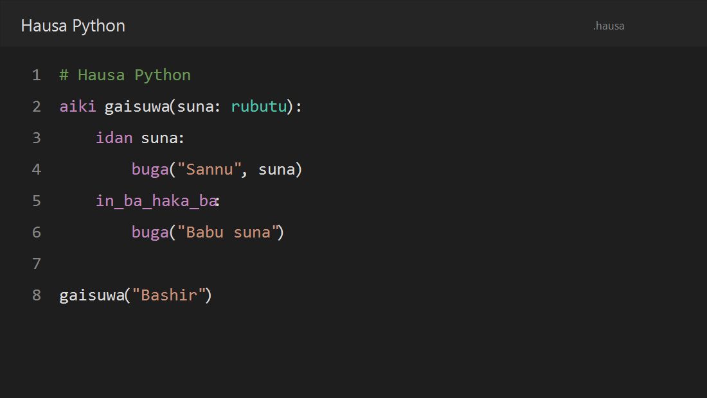
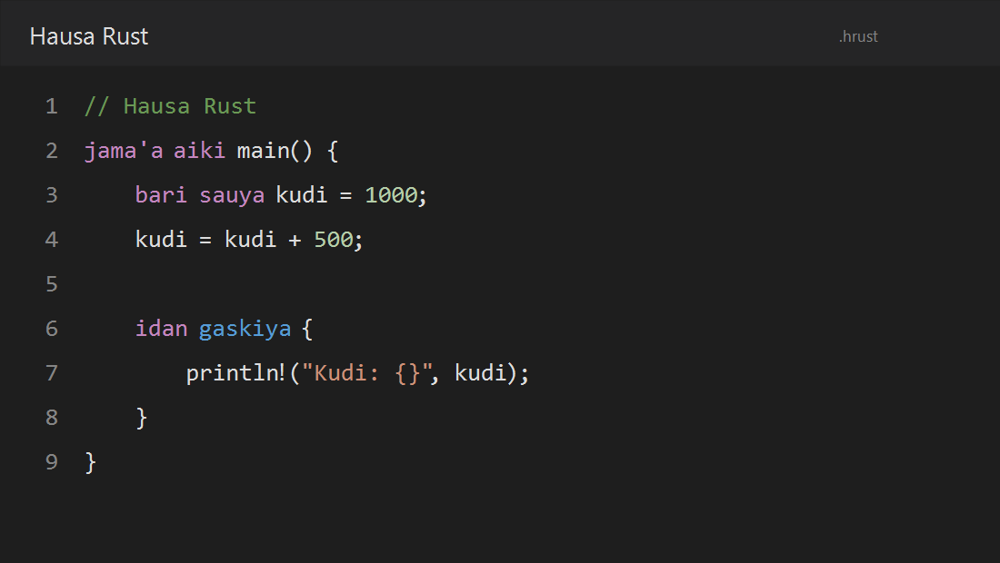

# Hausa Programming Language Support

VS Code language support for the Hausa Ecosystem Version 1.





## Included

- Syntax highlighting for Hausa Python (`.hausa`)
- Syntax highlighting for Hausa Rust (`.hrust`)
- Hausa Python and Hausa Rust snippets
- Correct comments, brackets, auto-closing pairs, and indentation behavior
- Support in desktop VS Code, virtual workspaces, and vscode.dev
- Distinct colors for control flow, constants, types, built-ins, framework
  vocabulary, and Rust declarations
- Run, check, and translate commands from the Command Palette or editor menu
- Hausa keyword completion and English hover explanations
- Problems-panel diagnostics whenever a Hausa file is saved
- Workspace vocabulary-profile selection

This release is intentionally limited to Hausa Python and Hausa Rust. Java and
C++ support are planned for later releases and are not included yet.

## Hausa Python example

```python
aiki gaisuwa(suna: rubutu):
    idan suna:
        buga("Sannu", suna)
    in_ba_haka_ba:
        buga("Babu suna")

gaisuwa("Bashir")
```

## Hausa Rust example

```rust
jama'a aiki main() {
    bari sauya kudi = 1000;
    kudi = kudi + 500;

    idan gaskiya {
        println!("Kudi: {}", kudi);
    }
}
```

## Snippets

Type a prefix and press `Ctrl+Space`:

| Prefix | Result |
| --- | --- |
| `buga` | Hausa Python print call |
| `idan` | Hausa Python conditional block |
| `aiki` | Hausa Python function |
| `bayar` | Hausa Python generator |
| `sqlite` | SQLite starter |
| `flask-route` | Flask route |
| `fastapi-route` | FastAPI route |
| `main` | Hausa Rust main function |

## Running programs

The extension works without the runner. To execute programs, clone the project
repository and install the separate Python package from that checkout:

```powershell
git clone https://github.com/Bkzazzau1/hausa-ecosystem.git
cd hausa-ecosystem
python -m pip install -e .
hausa run app.hausa
```

## Editor commands

Open the Command Palette with `Ctrl+Shift+P` and search for `Hausa:`:

| Command | Purpose |
| --- | --- |
| `Hausa: Run Current File` | Run the active `.hausa` or `.hrust` file |
| `Hausa: Check Current File` | Check syntax and populate the Problems panel |
| `Hausa: Translate Current File to English` | Create `.py` or `.rs` output |
| `Hausa: Translate Python/Rust File to Hausa` | Create `.hausa` or `.hrust` output |
| `Hausa: Select Vocabulary Profile` | Select core, built-ins, database, framework, web, or all |

Hover over a Hausa keyword to see its English meaning and available profiles.
Press `Ctrl+Space` for keyword completion.

## Settings

| Setting | Default | Purpose |
| --- | --- | --- |
| `hausa.executablePath` | `hausa` | CLI command or absolute executable path |
| `hausa.vocabularyProfile` | `all` | Profile used for Python run/translation commands |
| `hausa.diagnosticsOnSave` | `true` | Check saved Hausa files in the Problems panel |
| `hausa.diagnosticsOnType` | `false` | Check unsaved Hausa source after typing pauses |
| `hausa.diagnosticsDelayMs` | `750` | Typing pause before an unsaved-source check (250–5000 ms) |

The extension itself does not execute code and does not run background
processes. See the [project repository](https://github.com/Bkzazzau1/hausa-ecosystem)
for documentation, examples, and issue reporting.

## Release scope

Version 1.2 provides highlighting, snippets, commands, live diagnostics, profile-aware completion,
and hover help. Java and C++ remain future work.
